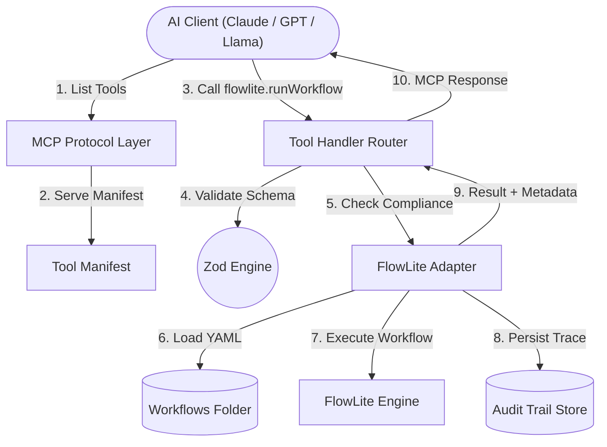

# FlowLite MCP Bridge 🌉

[](https://github.com/kobomarun/flowlite-mcp-bridge/actions)
[](LICENSE)
[](CONTRIBUTING.md)

> A **Model Context Protocol (MCP) server** that exposes FlowLite workflow automation as structured, auditable AI tools  with built-in compliance gates and non-repudiable audit trails.

---

## 🤔 Why does this exist?

Modern AI agents (Claude, GPT5, Llama, etc) are powerful, but they need a **safe, structured way** to trigger real-world automations. Without governance, an AI could:
- Execute a payment without a human approving it.
- Take an irreversible action with no trace left behind.
- Access sensitive data it shouldn't.

**FlowLite-MCP Bridge solves this.** It wraps your FlowLite workflows in a battle-hardened protocol that forces the AI to go through compliance gates before any action runs.

---

## 🎯 Use Cases

While our examples often use invoices, the bridge is designed for **any multi-step automation** that needs governance:

- **🏗️ Infrastructure**: "Spin up a staging environment for PR #42." (Requires approval for cost control).
- **🔒 Security**: "Revoke access for user `john_doe` across all 12 SaaS platforms." (Audit trail mandatory).
- **👋 Onboarding**: "Set up a new engineer's email, Jira, and GitHub access." (Multi-step sequential logic).
- **📊 Data Pipelines**: "Extract customer feedback from this Slack thread and write it to the DB." (AI-driven extraction).

---

## 🚀 Quickstart

### Option A — Use directly from npm (no cloning required):
```bash
npx flowlite-mcp-bridge --workflows-dir ./workflows --data-dir ./audit-trails --verbose
```

### Option B — Clone & run locally:
```bash
# 1. Clone and install
git clone https://github.com/kobomarun/flowlite-mcp-bridge.git && cd flowlite-mcp-bridge && npm install

# 2. Build and set up your demo playground (copies example workflows)
npm run build && npm run setup-demo

# 3. Start the bridge
node dist/cli/serve.js --workflows-dir ./playground/workflows --data-dir ./playground/data --verbose
```

When running, you will see:
```
info: Starting MCP Server: FlowLite MCP Bridge v0.1.0
info: Server connected and listening on stdin/stdout
```

---

## 🤖 Connecting to an AI Client

### Claude Desktop
Add to `~/Library/Application Support/Claude/claude_desktop_config.json`:
```json
{
  "mcpServers": {
    "flowlite": {
      "command": "npx",
      "args": [
        "-y", "flowlite-mcp-bridge",
        "--workflows-dir", "/absolute/path/to/your/workflows",
        "--data-dir", "/absolute/path/to/store/audit-logs"
      ]
    }
  }
}
```
Restart Claude Desktop. A **🔌 FlowLite** tool indicator will appear and you can say:
> *"Run the invoice workflow for Acme Corp with amount 1250."*

### Cursor IDE
Go to **Settings → MCP** and add:
```json
{
  "flowlite": {
    "command": "node",
    "args": [
      "/path/to/flowlite-mcp-bridge/dist/cli/serve.js",
      "--workflows-dir", "./workflows",
      "--data-dir", "./audit-trails"
    ]
  }
}
```

This also works with 🟢 **Windsurf** and 🧡 **Ollama + Open WebUI** using the same config format.

---

## ✍️ Write Your First Workflow

Create `./workflows/hello.yml`:
```yaml
id: hello-world
name: Hello World Workflow
version: 1.0.0
compliance:
  requiresHumanApproval: false
steps:
  - id: greet
    action: flowlite.log
    input:
      message: "Hello from FlowLite!"
```

Then call it from any AI client:
```json
{
  "method": "tools/call",
  "params": {
    "name": "flowlite.runWorkflow",
    "arguments": { "workflowId": "hello-world", "inputs": {} }
  }
}
```

---

## 🏗️ Architecture



> Full details in [`docs/ARCHITECTURE.md`](./docs/ARCHITECTURE.md)

---

## 🚦 Governance & Safety

| Feature | Status |
|---|---|
| Core Orchestration | ✅ Real FlowLite Engine Integration |
| Human-in-the-Loop (HITL) approval gates | ✅ Enforced |
| Non-repudiable audit trail per run | ✅ Enforced |
| Data Classification levels | ✅ Enforced |
| Strict Zod schema validation at boundary | ✅ Enforced |
| Path traversal protection | ✅ Enforced |

> Full details in [`docs/GOVERNANCE.md`](./docs/GOVERNANCE.md)

---

## 📚 Learn More

- **[Architecture](./docs/ARCHITECTURE.md)**: How the adapter pattern and engine orchestration works.
- **[Tutorials](./docs/TUTORIALS.md)**: Real-world guides for DevOps, SecOps, and HR automation.
- **[Usage Guide](./docs/USAGE.md)**: Detailed CLI flags and client connection settings.
- **[Governance](./docs/GOVERNANCE.md)**: Deep dive into safety levels and audit trails.

---

## 🗺️ Roadmap

See [`ROADMAP.md`](./ROADMAP.md) for the full vision from Phase 1 (Foundation) to Phase 4 (Community & Ecosystem).

---

## 🤝 Contributing

We welcome contributions! Start here:

1. Read [`CONTRIBUTING.md`](./CONTRIBUTING.md) for technical standards (strict TypeScript, no `any`, schema-first design).
2. Check open [Issues](https://github.com/kobomarun/flowlite-mcp-bridge/issues) for tasks.
3. Use the [PR template](.github/pull_request_template.md) when submitting.

---

## 📜 License

[MIT](LICENSE) — Free to use, modify, and distribute.
