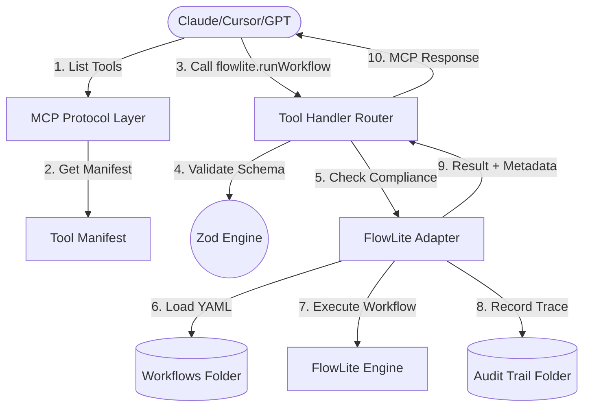

# FlowLite MCP Bridge 🌉


FlowLite MCP Bridge is a high-quality Model Context Protocol (MCP) server that exposes FlowLite workflow automation as structured AI tools. It is designed for enterprise-grade automation with a focus on compliance, auditability, and safety.

## 🚀 Features

- **Standardized MCP Interface**: Seamlessly integrate FlowLite workflows with any MCP-compatible AI client.
- **Strict Zod Validation**: Every tool call is validated at the boundary against Zod schemas.
- **Safety Gates**: Built-in enforcement of human-in-the-loop (HITL) approval requirements.
- **Detailed Audit Trails**: Generates non-repudiable JSON trace manifests for every run.
- **Structured Error Handling**: Returns context-rich domain errors that AI models understand.

## 🏗 Architecture

### High-Level Component Flow


## 🛠 Project Structure

- `src/flowlite/`: Domain logic, Zod types, and the main `FlowLiteAdapter`.
- `src/server/`: MCP protocol implementation, schema generation, and tool routing.
- `src/utils/`: Shared utilities like the Stdio-safe logger.
- `src/cli/`: CLI entry point (`flowlite-mcp`) built with Commander.js.
- `examples/`: Sample workflow YAMLs showing compliance configurations.
- `tests/`: Full unit and regression test suite.

## 🚦 Governance & Safety

FlowLite-MCP-Bridge treats compliance as a first-class citizen, not an secondary feature. The bridge enforces safety through three distinct layers:

### 1. Human-in-the-Loop (HITL) Enforcement
When a workflow is marked with `requiresHumanApproval: true`, the bridge enters a **blocking state**.
*   The first tool call returns a "Blocked" status in the response metadata.
*   The execution is paused before any logic runs.
*   The caller must re-submit the tool call with `humanApprovalGranted: true` to proceed.

### 2. Audit Trace Generation
For every execution, a permanent JSON file is written to the `--data-dir`. These traces capture:
*   The exact inputs provided by the AI.
*   Which steps were skipped or executed.
*   Timestamps and completion status.
*   The `requestId` linking the trace back to the MCP call.

### 3. Data Classification
The bridge respects the `dataClassification` level of each workflow (Public, Internal, Confidential, Restricted). This information is surfaced to the AI client to ensure sensitive data is handled in accordance with organizational policies.

## 📦 Setting Up Claude Desktop

To use this bridge with Claude Desktop, add the following to your `claude_desktop_config.json`:

```json
{
  "mcpServers": {
    "flowlite": {
      "command": "node",
      "args": [
        "/absolute/path/to/flowlite-mcp-bridge/dist/cli/serve.js",
        "--workflows-dir", "/path/to/your/workflows",
        "--data-dir", "/path/to/store/audit-logs"
      ]
    }
  }
}
```

## ⚒️ Development

### Setup
```bash
npm install
npm run build
```

### Useful Commands
- `npm run dev`: Start in development mode with watch-build.
- `npm run lint`: Check code style with ESLint.
- `npm run typecheck`: Final TypeScript check.
- `npm test`: Run the Vitest suite.

## 📜 License

[MIT](LICENSE)
