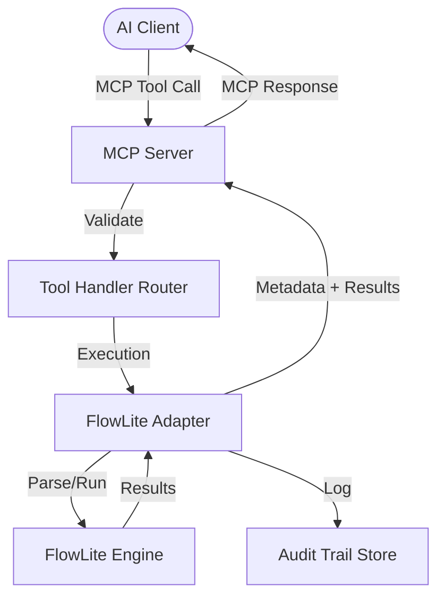

# FlowLite MCP Bridge 🌉

FlowLite MCP Bridge is a high-quality Model Context Protocol (MCP) server that exposes FlowLite workflow automation as structured AI tools. It is designed for enterprise-grade automation with a focus on compliance, auditability, and safety.

## 🚀 Features

- **Standardized MCP Interface**: Seamlessly integrate FlowLite workflows with AI clients like Claude, ChatGPT, and more.
- **Strict Zod Validation**: All tool inputs and outputs are strictly validated using Zod schemas.
- **Compliance first**: Inherently supports human-in-the-loop (HITL) approvals and data classification.
- **Audit Trails**: Generates structured trace manifests for every workflow execution.
- **Safe Replay**: Capability to replay failed workflows with corrected parameters.

## 🏗 Architecture



## 🛠 Project Structure

- `src/flowlite/`: Core domain types and the adapter layer.
- `src/server/`: MCP protocol implementation and tool handlers.
- `src/utils/`: Shared utilities (logging, path handling).
- `src/cli/`: Command-line interface for serving the bridge.
- `tests/`: Comprehensive test suite.

## 🚦 Governance & Safety

The bridge enforces FlowLite’s compliance rules through:
1. **Human-in-the-Loop (HITL)**: Tools marked as `highRisk` or requiring approval will return a metadata flag, blocking execution until an explicit approval token is provided.
2. **Auditability**: Every `runWorkflow` call writes a trace manifest to the `--data-dir`, ensuring a full permanent record of AI-triggered actions.
3. **Data Classification**: Workflows are tagged with classification levels (Public, Internal, Confidential, Restricted) to guide AI handling of sensitive information.

## 📦 Installation

```bash
npm install
```

## 🏃 Usage

```bash
npm run dev
```

## 📜 License

MIT
